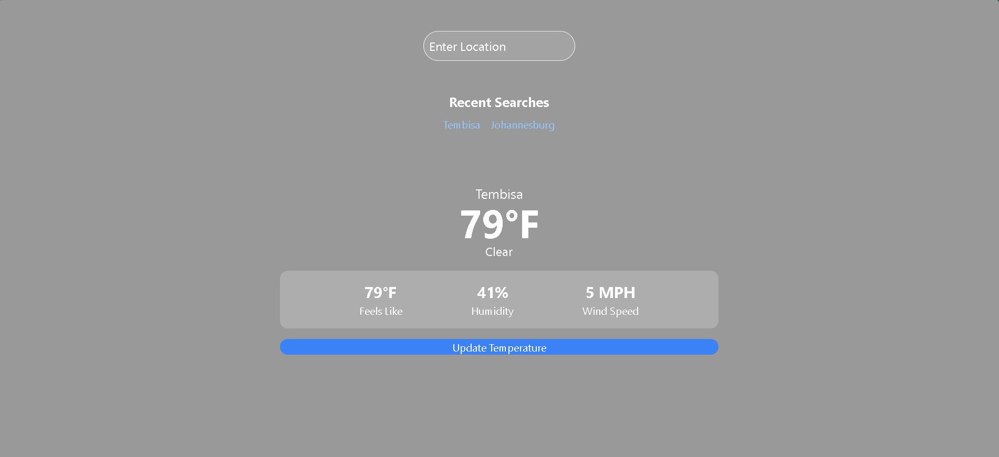

Weather Dashboard

OVERVIEW

Weather Dashboard is a simple user-friendly web application where users can search current weather conditions and view  weather details such as humidity and wind speed.

FEATURES

- Search of current weather using a city name
- display current Temperature, Weather condition, Humidity, and wind speed.
- Design is responsive for different devices
- Simple user-friendly interface
- automatically update to current conditions after 60seconds and has a manual update button

TECHNOLOGIES USED

- Reactjs
- Tailwind css
- Axios for API calls
- OpenWeatherMap API 

REPOSITORY

  https://github.com/MARTIN-MONYEBODI/ALX-FINAL-CAPSTONE-PROJECT.git